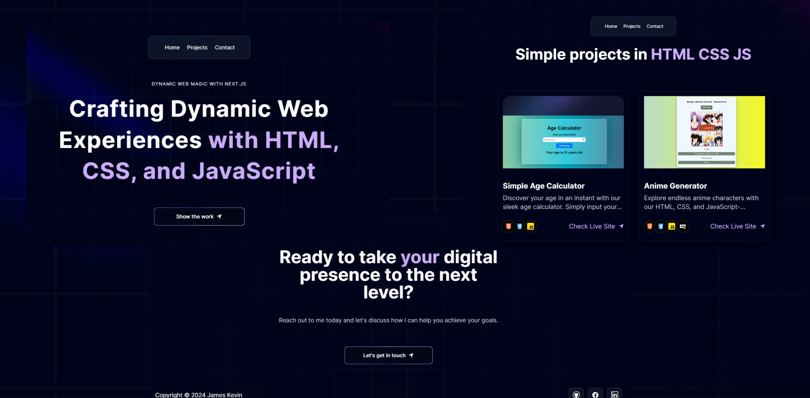

<div align="center">
  <br />
      
  <br />

  <div>
    
    
    
    
    
  </div>

  <h3 align="center">A Modern Next.js Project Blog</h3>

</div>

## 📋 <a name="table">Table of Contents</a>

1. 🤖 [Introduction](#introduction)
2. ⚙️ [Tech Stack](#tech-stack)
3. 🔋 [Features](#features)
4. 🤸 [Quick Start](#quick-start)
5. 🕸️ [Code to Copy](#snippets)


## <a name="introduction">🤖 Introduction</a>

Built with Next.js for handling the user interface, Three.js for rendering 3D elements, Framer motion for beautiful animations, styled with TailwindCSS and coded in Typescript, this project blog demonstrates the developer's skills in a unique manner that creates a lasting impact.


## <a name="tech-stack">⚙️ Tech Stack</a>

- Next.js
- Three.js
- Framer Motion
- Tailwind CSS
- Typescript

## <a name="features">🔋 Features</a>

👉 **Hero**: Captivating introduction featuring a spotlight effect and dynamic background.

👉 **Bento Grid**: Modern layout presenting personal information using cutting-edge CSS design techniques.

👉 **3D Elements**:  Interactive 3D design elements, such as a GitHub-style globe and card hover effects, adding depth and engagement.

👉 **Canvas Effect**: Innovative use of HTML5 canvas to create visually striking effects in the "approaches" section.

👉 **Responsiveness**: Seamless adaptability across all devices, ensuring optimal viewing experience for every user.

and many more, including code architecture and reusability 

## <a name="quick-start">🤸 Quick Start</a>

Follow these steps to set up the project locally on your machine.

**Prerequisites**

Make sure you have the following installed on your machine:

- [Git](https://git-scm.com/)
- [Node.js](https://nodejs.org/en)
- [npm](https://www.npmjs.com/) (Node Package Manager)

**Cloning the Repository**

```bash
git clone https://github.com/LuffyThePirateKing2023/simple-html-css-js-project.git
cd simple-html-css-js-project
```

**Installation**

Install the project dependencies using npm:

```bash
npm install
```

**Running the Project**

```bash
npm run dev
```

Open [http://localhost:3000](http://localhost:3000) in your browser to view the project.

## <a name="snippets">🕸️ Snippets</a>

<details>
<summary><code>data/index.ts</code></summary>

```typescript

export const navItems = [
  { name: "Home", link:"#home"},
  { name: "Projects", link: "#projects" },
  { name: "Contact", link: "#contact" },
];

export const projects = [
  {
    id: 1,
    title: "Simple Age Calculator",
    des: "Discover your age in an instant with our sleek age calculator. Simply input your birthdate and see your current age appear magically!",
    img: "/p1.png",
    iconLists: ["/html.svg", "/css.svg", "/js.svg"],
    link: "https://luffythepirateking2023.github.io/HTML-CSS-Js-projects/age-calculator/",
  },

   {
    id: 2,
    title: "Anime Generator",
    des: "Explore endless anime characters with our HTML, CSS, and JavaScript-powered generator, fueled by an API. Discover unique styles and personalities with every click!",
    img: "/p2.png",
    iconLists: ["/html.svg", "/css.svg", "/js.svg", "/api.svg"],
    link: "https://luffythepirateking2023.github.io/HTML-CSS-Js-projects/anime-generator/",
  },
  
     {
    id: 3,
    title: "Basic Calculator",
    des: "Perform quick calculations with our basic calculator built using HTML, CSS, and JavaScript. Simple, fast, and efficient for everyday math needs",
    img: "/p3.png",
    iconLists: ["/html.svg", "/css.svg", "/js.svg"],
    link: "https://luffythepirateking2023.github.io/HTML-CSS-Js-projects/basic-calculator/",
  },

  {
    id: 4,
    title: "BMI Calculator",
    des: "Calculate your Body Mass Index (BMI) effortlessly with our tool built using HTML, CSS, and JavaScript. Enter your height and weight to instantly see your BMI and health category.",
    img: "/p4.png",
    iconLists: ["/html.svg", "/css.svg", "/js.svg"],
    link: "https://luffythepirateking2023.github.io/HTML-CSS-Js-projects/bmi-caclulator/",
  },

 {
    id: 5,
    title: "Real-time Currency Converter",
    des: "Convert currencies in real-time instantly with our converter built using HTML, CSS, and JavaScript. Enter amounts and select currencies to get real-time exchange rates and conversions",
    img: "/p5.png",
    iconLists: ["/html.svg", "/css.svg", "/js.svg", "/api.svg"],
    link: "https://luffythepirateking2023.github.io/HTML-CSS-Js-projects/currency-converter/",
  },

   {
    id: 6,
    title: "Digital Clock",
    des: "Stay on time with our digital clock built using HTML, CSS, and JavaScript. Displaying the current time with precision, it updates every second for real-time accuracy.",
    img: "/p6.png",
    iconLists: ["/html.svg", "/css.svg", "/js.svg"],
    link: "https://luffythepirateking2023.github.io/HTML-CSS-Js-projects/digital-clock/",
  },

  {
    id: 7,
    title: "Englich Dictionary",
    des: "Enhance your vocabulary with our English dictionary app, built using HTML, CSS, JavaScript, and a dictionary API. Get real-time definitions, synonyms, and usage examples with every search.",
    img: "/p7.png",
    iconLists: ["/html.svg", "/css.svg", "/js.svg", "/api.svg"],
    link: "https://luffythepirateking2023.github.io/HTML-CSS-Js-projects/english-dictionary/",
  },

    {
    id: 8,
    title: "Dad-Joke Generator",
    des: "Brighten your day with our Dad Joke Generator, crafted using HTML, CSS, JavaScript, and a jokes API. Get a new hilarious dad joke with every click!",
    img: "/p8.png",
    iconLists: ["/html.svg", "/css.svg", "/js.svg", "/api.svg"],
    link: "https://luffythepirateking2023.github.io/HTML-CSS-Js-projects/joke-generator/",
  },

  {
    id: 9,
    title: "Loan Calculator",
    des: "Calculate loan payments effortlessly with our loan calculator built using HTML, CSS, and JavaScript. Enter loan details to see instant results on monthly payments and interest.",
    img: "/p9.png",
    iconLists: ["/html.svg", "/css.svg", "/js.svg"],
    link: "https://luffythepirateking2023.github.io/HTML-CSS-Js-projects/loan-calculator/",
  },

  {
    id: 10,
    title: "Note Application",
    des: "Organize your thoughts with our note app, built using HTML, CSS, and JavaScript. Create, edit, and delete notes easily to keep track of your tasks and ideas.",
    img: "/p10.png",
    iconLists: ["/html.svg", "/css.svg", "/js.svg"],
    link: "https://luffythepirateking2023.github.io/HTML-CSS-Js-projects/note-app/",
  },

  {
    id: 11,
    title: "Password Generator",
    des: "Create secure passwords with our regex password generator, built using HTML, CSS, and JavaScript. Customize your criteria and generate strong passwords instantly.",
    img: "/p11.png",
    iconLists: ["/html.svg", "/css.svg", "/js.svg", "/regex.svg"],
    link: "https://luffythepirateking2023.github.io/HTML-CSS-Js-projects/password-generator/",
  },

  {
    id: 12,
    title: "Random Color Generator",
    des: "Explore colors with our random color generator, built using HTML, CSS, and JavaScript. Discover new palettes and hues with every click.",
    img: "/p12.png",
    iconLists: ["/html.svg", "/css.svg", "/js.svg"],
    link: "https://luffythepirateking2023.github.io/HTML-CSS-Js-projects/random-color-generator/",
  },

  {
    id: 13,
    title: "Random Quote Generator",
    des: "Discover inspiration with our random quote generator. Using HTML, CSS, and JavaScript, it delivers insightful quotes with each click.",
    img: "/p13.png",
    iconLists: ["/html.svg", "/css.svg", "/js.svg", "/api.svg"],
    link: "https://luffythepirateking2023.github.io/HTML-CSS-Js-projects/random-quote-generator/",
  },

  {
    id: 14,
    title: "Recipe Book Generator",
    des: "Unlock culinary inspiration with our recipe book generator. Powered by HTML, CSS, and JavaScript, it offers a diverse selection of recipes with every click.",
    img: "/p14.png",
    iconLists: ["/html.svg", "/css.svg", "/js.svg", "/api.svg"],
    link: "https://luffythepirateking2023.github.io/HTML-CSS-Js-projects/recipe-book-generator/",
  },

  {
    id: 15,
    title: "Rock Paper Scissor game",
    des: "Challenge yourself with our rock-paper-scissors game. Enjoy the classic fun of choosing between rock, paper, or scissors, all built with HTML, CSS, and JavaScript.",
    img: "/p15.png",
    iconLists: ["/html.svg", "/css.svg", "/js.svg"],
    link: "https://luffythepirateking2023.github.io/HTML-CSS-Js-projects/rock-paper-scissor-game/",
  },
  
  {
    id: 16,
    title: "Roll a Dice Game",
    des: "Roll the dice and test your luck with our interactive dice game. Built using HTML, CSS, and JavaScript, it offers random outcomes and endless fun.",
    img: "/p16.png",
    iconLists: ["/html.svg", "/css.svg", "/js.svg"],
    link: "https://luffythepirateking2023.github.io/HTML-CSS-Js-projects/roll-a-dice-app/",
  },

  {
    id: 17,
    title: "Stopwatch Application",
    des: "Track time accurately with our stopwatch application. Built using HTML, CSS, and JavaScript, it provides precise timing and easy controls for various activities.",
    img: "/p17.png",
    iconLists: ["/html.svg", "/css.svg", "/js.svg"],
    link: "https://luffythepirateking2023.github.io/HTML-CSS-Js-projects/stopwatch-app/",
  },

  {
    id: 18,
    title: "Temperature Converter",
    des: "Convert temperatures seamlessly with our temperature converter. Using HTML, CSS, and JavaScript, it offers quick and accurate conversions between Celsius, Fahrenheit, and Kelvin.",
    img: "/p18.png",
    iconLists: ["/html.svg", "/css.svg", "/js.svg"],
    link: "https://luffythepirateking2023.github.io/HTML-CSS-Js-projects/temperature-converter/",
  },

  {
    id: 19,
    title: "Weight Converter",
    des: "Experience seamless weight conversions with our HTML, CSS, and JavaScript-powered weight converter. Instantly switch between units like pounds, kilograms, and more for quick and accurate results.",
    img: "/p19.png",
    iconLists: ["/html.svg", "/css.svg", "/js.svg"],
    link: "https://luffythepirateking2023.github.io/HTML-CSS-Js-projects/weight-converter/",
  },
  
  {
    id: 20,
    title: "Testimonial Slider",
    des: "Explore our interactive testimonial slider, crafted with HTML, CSS, and JavaScript. Easily navigate through customer testimonials for an engaging user experience.",
    img: "/p20.png",
    iconLists: ["/html.svg", "/css.svg", "/js.svg"],
    link: "https://luffythepirateking2023.github.io/HTML-CSS-Js-projects/testimonial-slider/",
  }

];

export const socialMedia = [
  {
    id: 1,
    img: "/git.svg",
    link:"https://github.com/LuffyThePirateKing2023"
  },
  {
    id: 2,
    img: "/twit.svg",
    link:"https://www.facebook.com/gmkevin.garciano"
  },
  {
    id: 3,
    img: "/link.svg",
    link:"https://www.linkedin.com/in/james-kevin-garciano-aba994286/"
  },
];

```

</details>

<details>
<summary><code>tailwind.config.ts</code></summary>

```ts
import type { Config } from "tailwindcss";

const svgToDataUri = require("mini-svg-data-uri");

const colors = require("tailwindcss/colors");
const {
  default: flattenColorPalette,
} = require("tailwindcss/lib/util/flattenColorPalette");

const config = {
  darkMode: ["class"],
  content: [
    "./pages/**/*.{ts,tsx}",
    "./components/**/*.{ts,tsx}",
    "./app/**/*.{ts,tsx}",
    "./src/**/*.{ts,tsx}",
    "./data/**/*.{ts,tsx}",
  ],
  prefix: "",
  theme: {
    container: {
      center: true,
      padding: "2rem",
      screens: {
        "2xl": "1400px",
      },
    },
    extend: {
      colors: {
        black: {
          DEFAULT: "#000",
          100: "#000319",
          200: "rgba(17, 25, 40, 0.75)",
          300: "rgba(255, 255, 255, 0.125)",
        },
        white: {
          DEFAULT: "#FFF",
          100: "#BEC1DD",
          200: "#C1C2D3",
        },
        blue: {
          "100": "#E4ECFF",
        },
        purple: "#CBACF9",
        border: "hsl(var(--border))",
        input: "hsl(var(--input))",
        ring: "hsl(var(--ring))",
        background: "hsl(var(--background))",
        foreground: "hsl(var(--foreground))",
        primary: {
          DEFAULT: "hsl(var(--primary))",
          foreground: "hsl(var(--primary-foreground))",
        },
        secondary: {
          DEFAULT: "hsl(var(--secondary))",
          foreground: "hsl(var(--secondary-foreground))",
        },
        destructive: {
          DEFAULT: "hsl(var(--destructive))",
          foreground: "hsl(var(--destructive-foreground))",
        },
        muted: {
          DEFAULT: "hsl(var(--muted))",
          foreground: "hsl(var(--muted-foreground))",
        },
        accent: {
          DEFAULT: "hsl(var(--accent))",
          foreground: "hsl(var(--accent-foreground))",
        },
        popover: {
          DEFAULT: "hsl(var(--popover))",
          foreground: "hsl(var(--popover-foreground))",
        },
        card: {
          DEFAULT: "hsl(var(--card))",
          foreground: "hsl(var(--card-foreground))",
        },
      },
      borderRadius: {
        lg: "var(--radius)",
        md: "calc(var(--radius) - 2px)",
        sm: "calc(var(--radius) - 4px)",
      },
      keyframes: {
        "accordion-down": {
          from: { height: "0" },
          to: { height: "var(--radix-accordion-content-height)" },
        },
        "accordion-up": {
          from: { height: "var(--radix-accordion-content-height)" },
          to: { height: "0" },
        },
        spotlight: {
          "0%": {
            opacity: "0",
            transform: "translate(-72%, -62%) scale(0.5)",
          },
          "100%": {
            opacity: "1",
            transform: "translate(-50%,-40%) scale(1)",
          },
        },
        shimmer: {
          from: {
            backgroundPosition: "0 0",
          },
          to: {
            backgroundPosition: "-200% 0",
          },
        },
        moveHorizontal: {
          "0%": {
            transform: "translateX(-50%) translateY(-10%)",
          },
          "50%": {
            transform: "translateX(50%) translateY(10%)",
          },
          "100%": {
            transform: "translateX(-50%) translateY(-10%)",
          },
        },
        moveInCircle: {
          "0%": {
            transform: "rotate(0deg)",
          },
          "50%": {
            transform: "rotate(180deg)",
          },
          "100%": {
            transform: "rotate(360deg)",
          },
        },
        moveVertical: {
          "0%": {
            transform: "translateY(-50%)",
          },
          "50%": {
            transform: "translateY(50%)",
          },
          "100%": {
            transform: "translateY(-50%)",
          },
        },
        scroll: {
          to: {
            transform: "translate(calc(-50% - 0.5rem))",
          },
        },
      },
      animation: {
        "accordion-down": "accordion-down 0.2s ease-out",
        "accordion-up": "accordion-up 0.2s ease-out",
        spotlight: "spotlight 2s ease .75s 1 forwards",
        shimmer: "shimmer 2s linear infinite",
        first: "moveVertical 30s ease infinite",
        second: "moveInCircle 20s reverse infinite",
        third: "moveInCircle 40s linear infinite",
        fourth: "moveHorizontal 40s ease infinite",
        fifth: "moveInCircle 20s ease infinite",
        scroll:
          "scroll var(--animation-duration, 40s) var(--animation-direction, forwards) linear infinite",
      },
    },
  },
  plugins: [
    require("tailwindcss-animate"),
    addVariablesForColors,
    function ({ matchUtilities, theme }: any) {
      matchUtilities(
        {
          "bg-grid": (value: any) => ({
            backgroundImage: `url("${svgToDataUri(
              `<svg xmlns="http://www.w3.org/2000/svg" viewBox="0 0 32 32" width="100" height="100" fill="none" stroke="${value}"><path d="M0 .5H31.5V32"/></svg>`
            )}")`,
          }),
          "bg-grid-small": (value: any) => ({
            backgroundImage: `url("${svgToDataUri(
              `<svg xmlns="http://www.w3.org/2000/svg" viewBox="0 0 32 32" width="8" height="8" fill="none" stroke="${value}"><path d="M0 .5H31.5V32"/></svg>`
            )}")`,
          }),
          "bg-dot": (value: any) => ({
            backgroundImage: `url("${svgToDataUri(
              `<svg xmlns="http://www.w3.org/2000/svg" viewBox="0 0 32 32" width="16" height="16" fill="none"><circle fill="${value}" id="pattern-circle" cx="10" cy="10" r="1.6257413380501518"></circle></svg>`
            )}")`,
          }),
        },
        { values: flattenColorPalette(theme("backgroundColor")), type: "color" }
      );
    },
  ],
} satisfies Config;

function addVariablesForColors({ addBase, theme }: any) {
  let allColors = flattenColorPalette(theme("colors"));
  let newVars = Object.fromEntries(
    Object.entries(allColors).map(([key, val]) => [`--${key}`, val])
  );

  addBase({
    ":root": newVars,
  });
}

export default config;
```

</details>

<details>
<summary><code>globals.css</code></summary>

```css
@tailwind base;
@tailwind components;
@tailwind utilities;

@layer base {
  :root {
    --background: 0 0% 100%;
    --foreground: 240 10% 3.9%;

    --card: 0 0% 100%;
    --card-foreground: 240 10% 3.9%;

    --popover: 0 0% 100%;
    --popover-foreground: 240 10% 3.9%;

    --primary: 240 5.9% 10%;
    --primary-foreground: 0 0% 98%;

    --secondary: 240 4.8% 95.9%;
    --secondary-foreground: 240 5.9% 10%;

    --muted: 240 4.8% 95.9%;
    --muted-foreground: 240 3.8% 46.1%;

    --accent: 240 4.8% 95.9%;
    --accent-foreground: 240 5.9% 10%;

    --destructive: 0 84.2% 60.2%;
    --destructive-foreground: 0 0% 98%;

    --border: 240 5.9% 90%;
    --input: 240 5.9% 90%;
    --ring: 240 10% 3.9%;

    --radius: 0.5rem;
  }

  .dark {
    --background: 240 10% 3.9%;
    --foreground: 0 0% 98%;

    --card: 240 10% 3.9%;
    --card-foreground: 0 0% 98%;

    --popover: 240 10% 3.9%;
    --popover-foreground: 0 0% 98%;

    --primary: 0 0% 98%;
    --primary-foreground: 240 5.9% 10%;

    --secondary: 240 3.7% 15.9%;
    --secondary-foreground: 0 0% 98%;

    --muted: 240 3.7% 15.9%;
    --muted-foreground: 240 5% 64.9%;

    --accent: 240 3.7% 15.9%;
    --accent-foreground: 0 0% 98%;

    --destructive: 0 62.8% 30.6%;
    --destructive-foreground: 0 0% 98%;

    --border: 240 3.7% 15.9%;
    --input: 240 3.7% 15.9%;
    --ring: 240 4.9% 83.9%;
  }
}

@layer base {
  * {
    @apply border-border !scroll-smooth;
  }
  body {
    @apply bg-background text-foreground;
  }
  button {
    @apply active:outline-none;
  }
}

@layer utilities {
  .heading {
    @apply font-bold text-4xl md:text-5xl text-center;
  }

  .black-gradient {
    background: linear-gradient(90deg, #161a31 0%, #06091f 100%);
  }
}
```

</details>


<details>
<summary><code>Linear Gradient</code></summary>

```js
style={{
        //   add these two
        //   you can generate the color from here https://cssgradient.io/
        background: "rgb(4,7,29)",
        backgroundColor:
          "linear-gradient(90deg, rgba(4,7,29,1) 0%, rgba(12,14,35,1) 100%)",
      }}
```
</details>


## <a name="links">🔗 Assets</a>

Assets used in the project can be found [here](https://drive.google.com/file/d/1ZmtiMilUYTp1wkiXWMFX6AUk-msE981-/view?usp=sharing)

